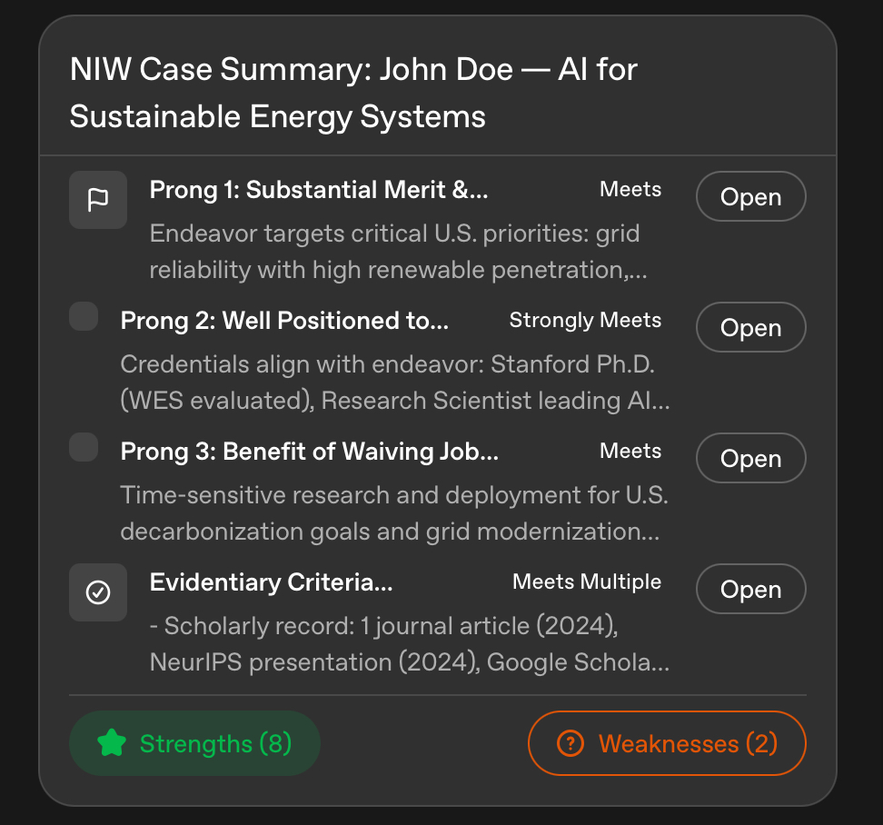

# test_niw_cv

1. Start the Python backend with python ``server.py`` (fastAPI) so that an API endpoint ``/run-agent`` is created for the ``run_workflow.py``
2. Open this ``test_ai_workflow.html`` file in your browser
3. On the website, ``test_ai_workflow.html``, Enter ``dummy_input.txt`` file content and click Run Agent. See if the output makes sense or not. Following output should be displayed.

## FINAL INTEGRATION WITH THE portfolio- ``https://fly-ai-solutions.github.io/test_niw_cv/``

If Step 3 TEST works, then generate the two jsons from the ``index.html`` page and call the ``run-agent`` API endpoint to generate the final output to display to the user.

## Last Step: Payment with Stripe, every time someone updates and wants to regenerate the petition it will ask for $9.99.

